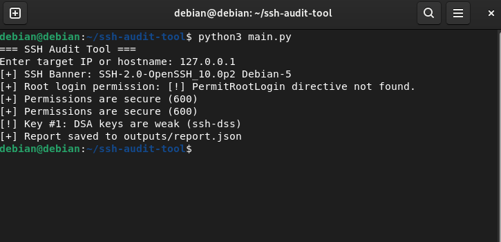

# 🔐 SSH Audit Tool

A lightweight Python tool for auditing SSH security settings on a local or remote Linux server.



## 🚀 Features

- Retrieve SSH version banner (e.g., OpenSSH)
- Check root login permission from `sshd_config`
- Analyze `authorized_keys` file:
  - Detect weak key types (e.g., DSA)
  - Validate secure file permissions (e.g., 600)
- Generate JSON audit report

## 📦 Output Example

Saved in `outputs/report.json`:

```json
{
  "timestamp": "2025-06-21 13:12:45",
  "target": "127.0.0.1",
  "ssh_banner": "SSH-2.0-OpenSSH_10.0p2 Debian-5",
  "root_login": "[!] PermitRootLogin directive not found.",
  "permission_issue": "[+] Permissions are secure (600)",
  "key_issues": ["[!] Key #1: DSA keys are weak (ssh-dss)"]
}

#⚙️ Requirements

    Python 3.x

    No external libraries required (uses standard library only)

#🛠 Usage

python3 main.py

Then enter the target IP or hostname (e.g., 127.0.0.1).

#📁 Project Structure

ssh-audit-tool/
├── audit/
│   ├── ssh_version_checker.py
│   ├── root_login_check.py
│   └── key_audit.py
├── outputs/
│   └── report.json
├── screenshots/
│   └── demo.png
├── main.py
└── README.md

